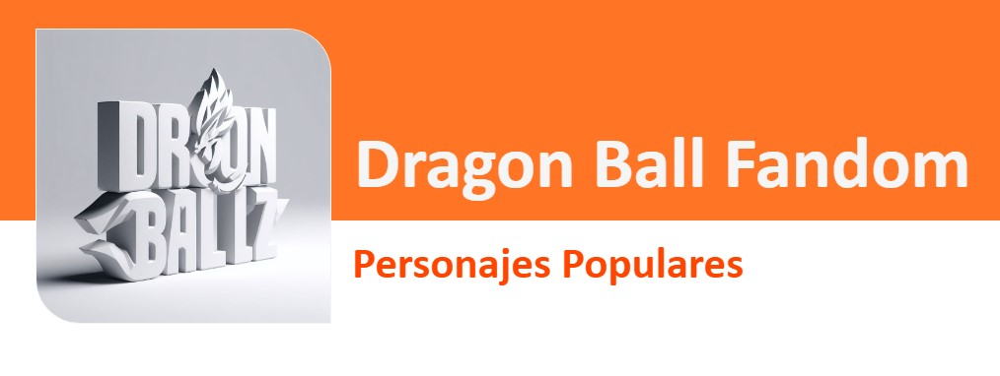

 

# Proyecto Dragon Ball Cards en 3D

## Tabla de Contenidos
- [Definición](#definición-del-Producto)
- [Funcionalidades](#funcionalidades)
- [Proceso de Diseño](#proceso-de-diseno)
- [Tecnologías Utilizadas](#tecnologías-utilizadas)
- [Estructura del Código](#estructura-del-código)
- [Uso](#uso)
- [Contribución y Desarrollo](#contribuciones-y-desarrollo)

## Definición del Producto

Este proyecto consiste en una aplicación web que muestra tarjetas con información de algunos personajes de Dragon Ball, acompañadas de imágenes en 3D. La idea es proporcionar a los usuarios una experiencia visual atractiva y fácil acceso a detalles relevantes sobre sus personajes favoritos de Dragon Ball.

## Funcionalidades

Este proyecto incluye diversas funcionalidades para mejorar la experiencia del usuario:

- **Visualizar Personajes:** Muestra 24 tarjetas de personajes con información detallada, incluyendo imágenes en 3D.

- **Filtrar por Planeta de Origen:** Ofrece la posibilidad de filtrar personajes por el planeta de origen mediante un menú desplegable.

- **Ordenar Alfabéticamente:** Permite ordenar la lista de personajes alfabéticamente, ya sea ascendente o descendente.

## Proceso de Diseño

El proceso de diseño se centró en la creación de una interfaz atractiva que emula cartas de juego, que  permitiera a los usuarios visualizar la información de los personajes de Dragon Ball a grades rasgos. Las imágenes en 3D en este proyecto busca agregar un elemento interactivo y visualmente impactante a la experiencia del usuario.

(images/Screenshot_1.jpg)

## Tecnologías Utilizadas

Este proyecto hace uso de las siguientes tecnologías:

- **HTML y CSS:** Utilizados para la estructura y estilo de la aplicación web.
- **JavaScript:** Implementado para la lógica de la aplicación, manipulación del DOM y gestión de eventos.

## Estructura del Código

### Archivo `main.js`

El archivo `main.js` alberga la lógica principal de la aplicación. Este archivo se encarga de manejar los eventos de escucha del DOM, respondiendo a las interacciones del usuario y coordinando la interactividad de la aplicación.

### Archivo `view.js`
Dentro de `view.js`, encontrarás una función que itera 24 veces para renderizar la estructura de las tarjetas en el navegador. Esta función es responsable de mostrar las tarjetas y la información de los personajes en la interfaz.

### Archivo `data.json`
El archivo data.json contiene la información de los personajes que se muestra en las tarjetas. Este archivo JSON proporciona detalles cruciales para cada personaje, como Nombre, Descripción, Planeta de Nacimiento, etc.

## Uso 

Para utilizar la aplicación, sigue estos pasos:

1. Clona el repositorio: `https://github.com/tamaracontreras/DEV012-dataverse`
2. Abre el archivo `index.html` en tu navegador web.
3. Explora las tarjetas de los personajes y disfruta de las imágenes en 3D.

## Contribuciones y Desarrollo

Si deseas contribuir al desarrollo de este proyecto, sigue estos pasos:

1. Haz un fork del repositorio.
2. Crea una rama para tu nueva funcionalidad: `git checkout -b nueva-funcionalidad`.
3. Realiza tus cambios y haz commit: `git commit -m "Agrega nueva funcionalidad"`.
4. Haz push a la rama: `git push origin nueva-funcionalidad`.
5. Abre un pull request en GitHub.

## Licencia
Este proyecto está bajo la licencia MIT.  [LICENSE](LICENSE) 

